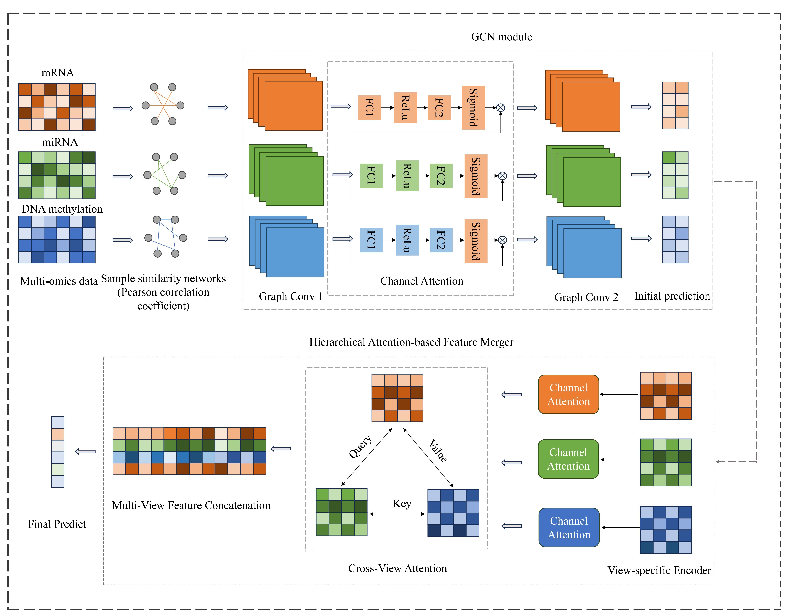

# MOGANet
A Multi-Omics Graph Attention Network for Cancer Diagnosis and Biomarker Identification
## Framework

- **BRCA**: This folder contains all the preprocessed omics data (e.g., mRNA, DNA methylation, miRNA) and label files for the BRCA (Breast Cancer) dataset.
- **Kidney**: This folder includes the processed multi-omics data and labels for the Kidney (KIPAN) dataset, which combines subtypes such as KIRC and KIRP.
- **LGG**: This folder stores the processed omics data and corresponding labels for the LGG (Lower Grade Glioma) dataset.
- **biomarker_results**: This file stores the identified important biomarkers selected by MGANet, including their rankings and functional annotations.
- **biomarker_analysis.py**: Calculates attention-based importance scores to identify top biomarkers from the trained model.
- **main_MOGANet.py**: Main entry script for training and testing MGANet on a selected dataset with predefined hyperparameters.
- **models.py**: Defines the MGANet model components, including GCN encoders, attention modules, HAFM fusion, and classifiers.
- **train_test.py**: Handles the training, evaluation, and biomarker analysis of MGANet using predefined train/test splits.
- **utils.py**: Provides utility functions for MGANet, including:
  - Sample weighting (`cal_sample_weight`) and one-hot encoding (`one_hot_tensor`)
  - Distance and correlation metrics (`cosine_distance_torch`, `pearson_correlation_torch`)
  - Graph adjacency matrix generation (`gen_adj_mat_tensor`, `gen_test_adj_mat_tensor`, `cal_adj_mat_parameter`)
  - Sparse tensor conversion (`to_sparse`)
  - Model saving and loading (`save_model_dict`, `load_model_dict`)

